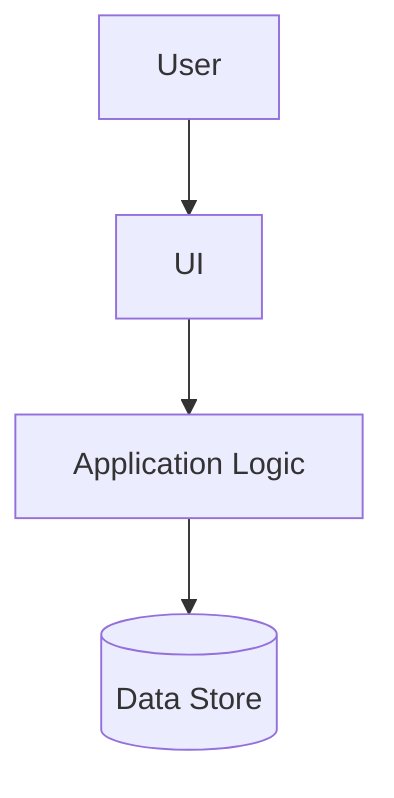
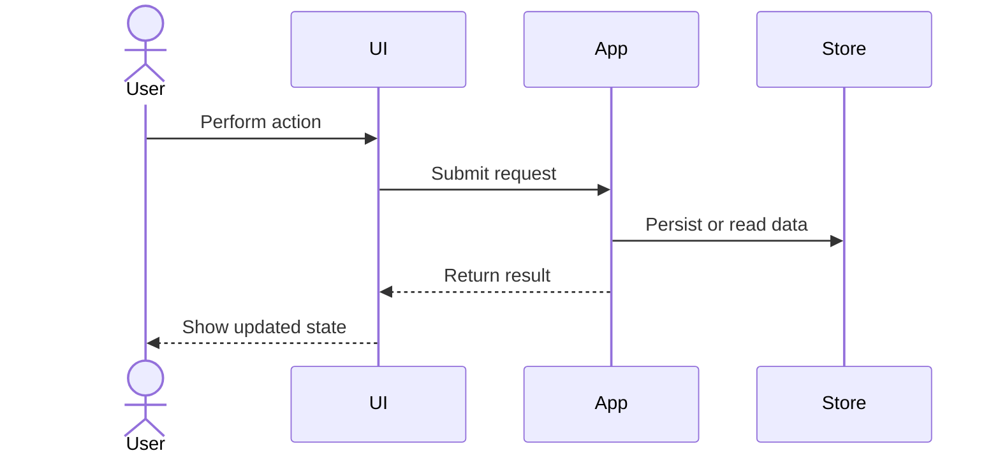
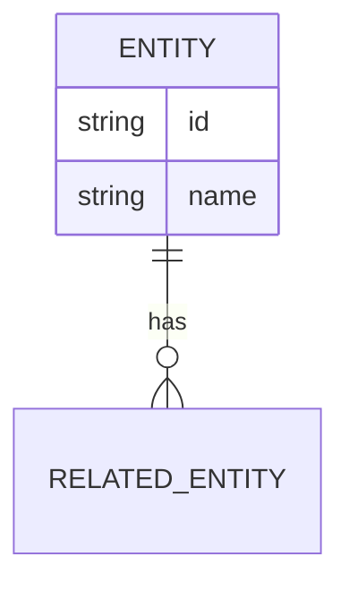

## Overview

The Change Documenter creates or updates `documentation.md` with a human-readable, reviewer-friendly explanation of what changed. It compares the current working tree, staged changes, or a requested diff range and documents functional, UI, API, database, architecture, data-flow, and user-story impacts.

Use this skill after code changes are made and before PR review. The output should help a reviewer understand what changed, why it matters, and which diagrams are useful.

## Instructions

### Step 1: Determine Scope

1. Start from the user's requested scope when provided:
   - Current working tree
   - Staged changes
   - A branch comparison
   - A commit or PR diff
   - Specific files or modules
2. If no scope is provided, inspect `git status --short` and `git diff --stat` from the repository root.
3. Read only the files needed to understand the changed behavior, data contracts, and UI surfaces.
4. Preserve existing user edits. Do not revert or rewrite unrelated files.

Output for this step: scope reviewed, files inspected, and assumptions.

### Step 2: Classify Changes

Classify each meaningful change under one or more categories:

- User story changes: new, removed, or modified user workflows or acceptance criteria.
- Functional changes: behavior, validation, business rules, state transitions, calculations, permissions, or error handling.
- UI changes: screens, components, labels, layout, interactions, accessibility, responsive behavior, or translated text.
- API changes: routes, request/response schemas, status codes, authentication, headers, events, or external integrations.
- Database changes: tables, fields, indexes, constraints, migrations, seed data, relationships, or persistence behavior.
- Architecture changes: module boundaries, service ownership, dependency direction, runtime topology, framework changes, or cross-cutting patterns.
- Data-flow changes: input, processing, storage, output, async processing, queues, jobs, or external system flow.
- End-to-end changes: complete path from user action through UI, API/service, persistence, and response.
- Non-functional changes: performance, security, observability, reliability, documentation, tests, or build tooling.

Output for this step: categorized change summary and any categories with no observed change.

### Step 3: Decide Which Diagrams To Generate

Generate Mermaid diagrams only when the change makes a diagram useful. Do not force every diagram into every document.

Use this decision guide:

- User story or workflow changed: add a user journey or flowchart.
- Architecture changed: add an architecture graph.
- Database schema or relationships changed: add an ERD.
- Data movement or transformations changed: add a DFD-style flowchart.
- End-to-end behavior changed: add a sequence diagram or end-to-end flowchart.
- API contract changed: add a sequence diagram or request/response flow.
- UI navigation changed: add a screen-flow diagram.
- No meaningful change in a category: explicitly write `No changes observed` for that category and skip the diagram.

Mermaid requirements:

1. Use fenced code blocks with `mermaid`.
2. Keep diagrams small enough for reviewers to scan.
3. Use stable node names and avoid implementation noise.
4. Add a one-paragraph explanation before each diagram.
5. Validate Mermaid syntax by inspection before finalizing.

Recommended diagram types:







Output for this step: list of diagrams generated and diagrams intentionally skipped.

### Step 4: Create Or Update documentation.md

Create or update `documentation.md` at the repository root unless the user requests another path.

Use this structure:

```markdown
# Change Documentation

## Summary

## Scope Reviewed

## Changes By Category

### User Stories

### Functional Changes

### UI Changes

### API Changes

### Database Changes

### Architecture Changes

### Data Flow Changes

### End-to-End Flow

### Non-Functional Changes

## Diagrams

### User Story Flow

### Architecture Diagram

### Entity Relationship Diagram

### Data Flow Diagram

### End-to-End Sequence

### Additional Diagrams

## Compatibility And Migration Notes

## Testing And Validation

## Open Questions
```

Rules:

1. Keep wording clear and reviewer-friendly.
2. Prefer concrete file and symbol references over vague summaries.
3. For categories with no change, write `No changes observed`.
4. Mention tests, commands, screenshots, or manual checks that validate the change.
5. Do not invent APIs, database fields, or diagrams that are not supported by the diff.
6. If an existing `documentation.md` exists, preserve useful historical content and append or update the current change section.

Output for this step: `documentation.md` path and section summary.

### Step 5: Validate Documentation

1. Check that `documentation.md` exists.
2. Confirm every requested category is covered:
   - User stories
   - Architecture
   - ERD
   - DFD
   - End-to-end diagrams
   - Functional changes
   - API changes
   - Database field changes
   - UI changes
3. Confirm Mermaid fences use ` ```mermaid `.
4. Confirm unsupported categories say `No changes observed` rather than guessing.
5. Run a markdown diagnostic check if available.
6. Summarize remaining gaps or open questions.

## Examples

### Example 1: UI And Translation Change

**Input:** "Use change-documenter for the current diff"

**Expected output:**

```text
Created documentation.md.
Documented functional and UI changes for language switching.
Generated a user flow diagram and an end-to-end sequence diagram.
API changes: No changes observed.
Database changes: No changes observed.
```

### Example 2: Database Migration Change

**Input:** "Document the schema changes in this branch"

**Expected output:**

```text
Updated documentation.md.
Documented database field changes, migration notes, and compatibility risks.
Generated an ERD and data-flow diagram.
UI changes: No changes observed.
API changes: No changes observed.
```

## Success Criteria

- [ ] `documentation.md` created or updated.
- [ ] Scope and assumptions are documented.
- [ ] User story changes are documented or marked `No changes observed`.
- [ ] Functional changes are documented or marked `No changes observed`.
- [ ] API changes are documented or marked `No changes observed`.
- [ ] Database field changes are documented or marked `No changes observed`.
- [ ] UI changes are documented or marked `No changes observed`.
- [ ] Architecture changes are documented or marked `No changes observed`.
- [ ] ERD, DFD, end-to-end, and other diagrams are generated only when supported by observed changes.
- [ ] Mermaid diagrams are syntactically plausible and reviewer-friendly.
- [ ] Testing and validation evidence is included.
